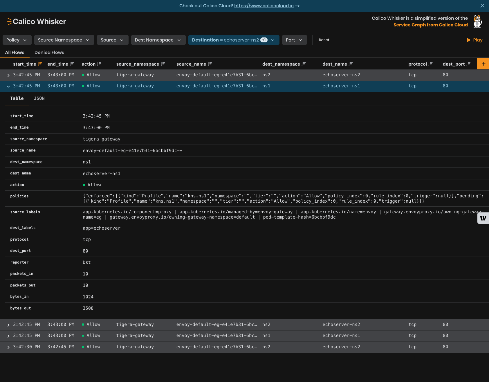

# Module 2 - Configuring and Testing Calico Ingress Gateway

Calico Ingress Gateway is a recent addition to Calico, enabling you to manage ingress traffic. Calico Ingress Gateway integrates a hardened version of the Envoy Gateway implementation in order to provide support for the Gateway API.

Calico Ingress Gateway is available in all editions of Calico, but only Calico Cloud and Calico Enterprise are eligible to receive support.

## Prerequisites
A Calico Open Source cluster, version 3.30+.

## Monitor network traffic in Calico Whisker

The Whisker web console deploys automatically, but it is not accessible from outside the cluster by default.
To view the web console, you need to allow access.

In this step, you will:

* **Set up port forwarding:** This allows you to access the Whisker web console from your browser.
* **Open the Whisker web console:** View the network traffic logs in real time.

### Access into a cluster from outside

The Gateway API only provides access into a cluster from outside when the cluster is _also_ provisioned to support Kubernetes Services with `type: LoadBalancer`.  When a Gateway is configured, Calico creates a Deployment that does the actual work of routing and load balancing, etc., and a Service with `type: LoadBalancer` that fronts that Deployment.  If the cluster has a `type: LoadBalancer` provider, it will then allocate an IP outside the cluster and arrange for requests to that IP to be forwarded to the Gateway Service.

Managed Kubernetes services like AKS, EKS and GKE include a `type: LoadBalancer` provider that automatically integrates with Azure, AWS and GCP respectively.  On-prem clusters and non-managed clusters in the cloud need to set up their own `type: LoadBalancer` support.

## How to

- [Enable Gateway API support](#enable-gateway-api-support)
- [Use the Gateway API](#use-the-gateway-api)
- [Disable Gateway API support](#disable-gateway-api-support)
- [Customize Gateway deployment and features](#customize-gateway-deployment-and-features)

### Enable Gateway API support

To enable Gateway API support, create a `GatewayAPI` resource with name `default`:

```bash,copy
kubectl apply -f - <<EOF
apiVersion: operator.tigera.io/v1
kind: GatewayAPI
metadata:
  name: default
EOF
```

Shortly after this you will see that Gateway API resources are now available:

```bash,copy
kubectl api-resources | grep gateway.networking.k8s.io
```

```bash,nocopy
backendlbpolicies                   blbpolicy                                       gateway.networking.k8s.io/v1alpha2          true         BackendLBPolicy
backendtlspolicies                  btlspolicy                                      gateway.networking.k8s.io/v1alpha3          true         BackendTLSPolicy
gatewayclasses                      gc                                              gateway.networking.k8s.io/v1                false        GatewayClass
gateways                            gtw                                             gateway.networking.k8s.io/v1                true         Gateway
grpcroutes                                                                          gateway.networking.k8s.io/v1                true         GRPCRoute
httproutes                                                                          gateway.networking.k8s.io/v1                true         HTTPRoute
referencegrants                     refgrant                                        gateway.networking.k8s.io/v1beta1           true         ReferenceGrant
tcproutes                                                                           gateway.networking.k8s.io/v1alpha2          true         TCPRoute
tlsroutes                                                                           gateway.networking.k8s.io/v1alpha2          true         TLSRoute
udproutes                                                                           gateway.networking.k8s.io/v1alpha2          true         UDPRoute
```

And also that there is a GatewayClass resource corresponding to the Envoy Gateway implementation included in $[prodname]:

```bash,copy
kubectl get gatewayclass -o=jsonpath='{.items[0].spec}' | jq
```

```bash,nocopy
{
  "controllerName": "gateway.envoyproxy.io/gatewayclass-controller",
  "parametersRef": {
    "group": "gateway.envoyproxy.io",
    "kind": "EnvoyProxy",
    "name": "tigera-gateway-class",
    "namespace": "tigera-gateway"
  }
}
```

### Use the Gateway API

Now you can use the Gateway API in any way that the API supports.  When configuring a Gateway resource, be sure to specify `gatewayClassName: tigera-gateway-class`.

By way of a simple example:

- Create echo servers in namespaces `ns1` and `ns2`:

  ```bash,copy
  kubectl apply -f - <<EOF
  apiVersion: v1
  kind: Namespace
  metadata:
    name: ns1
  ---
  apiVersion: v1
  kind: Pod
  metadata:
    name: echoserver-ns1
    namespace: ns1
    labels:
      app: echoserver
  spec:
    containers:
    - image: ealen/echo-server:latest
      imagePullPolicy: IfNotPresent
      name: echoserver
      ports:
      - containerPort: 80
      env:
      - name: PORT
        value: "80"
  ---
  apiVersion: v1
  kind: Service
  metadata:
    name: echoserver
    namespace: ns1
  spec:
    ports:
      - port: 80
        targetPort: 80
        protocol: TCP
    type: ClusterIP
    selector:
      app: echoserver
  ---
  apiVersion: v1
  kind: Namespace
  metadata:
    name: ns2
  ---
  apiVersion: v1
  kind: Pod
  metadata:
    name: echoserver-ns2
    namespace: ns2
    labels:
      app: echoserver
  spec:
    containers:
    - image: ealen/echo-server:latest
      imagePullPolicy: IfNotPresent
      name: echoserver
      ports:
      - containerPort: 80
      env:
      - name: PORT
        value: "80"
  ---
  apiVersion: v1
  kind: Service
  metadata:
    name: echoserver
    namespace: ns2
  spec:
    ports:
      - port: 80
        targetPort: 80
        protocol: TCP
    type: ClusterIP
    selector:
      app: echoserver
  EOF
  ```

- Create a client pod that we can test from:

  ```bash,copy
  kubectl apply -f - <<EOF
  apiVersion: v1
  kind: Pod
  metadata:
    name: test-client
  spec:
    containers:
    - args:
      - "36000"
      command:
      - /bin/sleep
      image: ubuntu
      imagePullPolicy: Always
      name: c1
    terminationGracePeriodSeconds: 0
  EOF
  ```

- Once that pod is running, install `curl` in it:

  ```bash,copy
  kubectl exec -it test-client -- apt-get -y update
  kubectl exec -it test-client -- apt-get -y install curl
  ```

- Configure a Gateway:

  ```bash,copy
  kubectl apply -f - <<EOF
  apiVersion: gateway.networking.k8s.io/v1
  kind: Gateway
  metadata:
    name: eg
  spec:
    gatewayClassName: tigera-gateway-class
    listeners:
      - name: http
        protocol: HTTP
        port: 80
  EOF
  ```

- Configure routes to the two echo servers:

  ```bash,copy
  kubectl apply -f - <<EOF
  apiVersion: gateway.networking.k8s.io/v1
  kind: HTTPRoute
  metadata:
    name: ns1-2-echo
  spec:
    parentRefs:
      - name: eg
    rules:
      - backendRefs:
          - group: ""
            kind: Service
            name: echoserver
            namespace: ns1
            port: 80
            weight: 1
        matches:
          - path:
              type: PathPrefix
              value: /ns1
      - backendRefs:
          - group: ""
            kind: Service
            name: echoserver
            namespace: ns2
            port: 80
            weight: 1
        matches:
          - path:
              type: PathPrefix
              value: /ns2
  EOF
  ```

- Configure the ReferenceGrants that are needed to allow the Gateway to reference services in other namespaces:

  ```bash,copy
  kubectl apply -f - <<EOF
  apiVersion: gateway.networking.k8s.io/v1beta1
  kind: ReferenceGrant
  metadata:
    name: echo
    namespace: ns1
  spec:
    from:
    - group: gateway.networking.k8s.io
      kind: HTTPRoute
      namespace: default
    to:
    - group: ""
      kind: Service
  ---
  apiVersion: gateway.networking.k8s.io/v1beta1
  kind: ReferenceGrant
  metadata:
    name: echo
    namespace: ns2
  spec:
    from:
    - group: gateway.networking.k8s.io
      kind: HTTPRoute
      namespace: default
    to:
    - group: ""
      kind: Service
  EOF
  ```

- Find the cluster IP of the Gateway Service:

  ```bash,copy
  kubectl get services -n tigera-gateway
  ```

  ```bash,nocopy
  NAME                        TYPE           CLUSTER-IP   EXTERNAL-IP     PORT(S)                                   AGE
  envoy-default-eg-e41e7b31   LoadBalancer   10.96.10.79   135.232.51.10   80:32636/TCP                              9m3s
  envoy-gateway               ClusterIP      10.96.184.241   <none>          18000/TCP,18001/TCP,18002/TCP,19001/TCP   36m
  ```

- Set the gateway as IP as a variable to make it easier: 

  ```bash,copy
  GATEWAY_SERVICE_IP=$(kubectl get services -n tigera-gateway -l 'gateway.envoyproxy.io/owning-gateway-name=eg' -o jsonpath='{.items[0].spec.clusterIP}')
  ```

  The Service for the Gateway is the one beginning with `envoy-default-`, followed by the name of the Gateway resource.  So the correct cluster IP in this case is 10.96.10.79.  (The `envoy-gateway` Service represents the gateway controller, which is the component that monitors for Gateway API resources and creates corresponding components to implement those.)

- Curl from the test client pod to a URL that should be handled by the echo server in namespace `ns1`, via the Gateway:

  ```bash,copy
  kubectl exec test-client -- curl http://$GATEWAY_SERVICE_IP/ns1/subpath\?query=demo | jq
  ```

- The output confirms - see the `"HOSTNAME"` line - that the request was handled by the echo server in namespace `ns1`:

  ```json,nocopy
  {
  "host": {
    "hostname": "10.96.10.79",
    "ip": "::ffff:10.244.9.132",
    "ips": []
  },
  "http": {
    "method": "GET",
    "baseUrl": "",
    "originalUrl": "/ns1/subpath?query=demo",
    "protocol": "http"
  },
  "request": {
    "params": {
      "0": "/ns1/subpath"
    },
    "query": {
      "query": "demo"
    },
    "cookies": {},
    "body": {},
    "headers": {
      "host": "10.96.10.79",
      "user-agent": "curl/8.5.0",
      "accept": "*/*",
      "x-forwarded-for": "10.244.9.131",
      "x-forwarded-proto": "http",
      "x-envoy-external-address": "10.244.9.131",
      "x-request-id": "984299b1-45b4-4b56-8d4a-82ae92ab354a"
    }
  },
  "environment": {
    "PATH": "/usr/local/sbin:/usr/local/bin:/usr/sbin:/usr/bin:/sbin:/bin",
    "HOSTNAME": "echoserver-ns1",
    "NODE_VERSION": "20.11.0",
    "YARN_VERSION": "1.22.19",
    "PORT": "80",
    "ECHOSERVER_PORT_80_TCP": "tcp://10.96.20.243:80",
    "ECHOSERVER_PORT_80_TCP_ADDR": "10.96.20.243",
    "KUBERNETES_SERVICE_PORT_HTTPS": "443",
    "KUBERNETES_PORT_443_TCP": "tcp://10.96.0.1:443",
    "KUBERNETES_PORT_443_TCP_PROTO": "tcp",
    "ECHOSERVER_SERVICE_HOST": "10.96.20.243",
    "ECHOSERVER_PORT_80_TCP_PORT": "80",
    "KUBERNETES_SERVICE_PORT": "443",
    "KUBERNETES_PORT": "tcp://10.96.0.1:443",
    "ECHOSERVER_PORT": "tcp://10.96.20.243:80",
    "KUBERNETES_PORT_443_TCP_ADDR": "10.96.0.1",
    "ECHOSERVER_SERVICE_PORT": "80",
    "ECHOSERVER_PORT_80_TCP_PROTO": "tcp",
    "KUBERNETES_SERVICE_HOST": "10.96.0.1",
    "KUBERNETES_PORT_443_TCP_PORT": "443",
    "HOME": "/root"
  }
  ```

- Curl from the test client pod to a URL that should be handled by the echo server in namespace `ns2`, via the Gateway:

  ```bash,copy
  kubectl exec test-client -- curl http://$GATEWAY_SERVICE_IP/ns2/subpath\?query=demo | jq
  ```

- The output confirms that the request was handled by the echo server in namespace `ns2`:

  ```
  ...
      "HOSTNAME": "echoserver-ns2",
  ...
  ```

### Verify traffic in Calico Whisker

- Open up Calico Whisker by visiting `localhost:8081` in your web browser.
  
  *You may need to revisit module 1 and port-forward to access Calico Whisker if you closed the shell.*

- Filter the traffic flows by specifying the destinations as `echoserver-ns1` and `echoserver-ns2`, or by Source Namespace: `tigera-gateway`.

  

  You should see all of the flows (depending on how many times you ran the test commands):

  

- You can expand any of the flows for more details about the flow. This contains useful information for creating or validating netowrk policies.

  

[:arrow_right: Module 3](module-3.md)  

[:arrow_left: Module 1](module-1.md) 

[:leftwards_arrow_with_hook: Back to Main](../readme.md)  