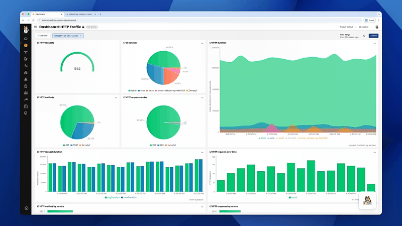

# Module 3 - Application Layer Logs and Policies in Calico Cloud

Calico Ingress Gateway is a recent addition to Calico, enabling you to manage ingress traffic. Calico Ingress Gateway integrates a hardened version of the Envoy Gateway implementation in order to provide support for the Gateway API.

Calico Ingress Gateway is available in all editions of Calico, but only Calico Cloud and Calico Enterprise are eligible to receive support.

## Prerequisites
A Calico Cloud or Enterprise account

## Monitor network traffic in Calico Whisker

Just like L3/4 Calico logs, platform operators and development teams want visibility into L7 logs to see how applications are interacting with each other. Calico flow logs only display which workloads are communicating with each other, not the specific request details. Calico provides visibility into L7 traffic without the need for a service mesh.

L7 logs are also key for detecting anomalous behaviors like attempts to access applications, restricted URLs, and scans for particular URLs.

### About L7 logs

L7 logs capture application interactions from HTTP header data in requests. Data shows what is actually sent in communications between specific pods, providing more specificity than flow logs. (Flow logs capture data only from connections for workload interactions).

Calico L7 logs are visible in the web console, service graph, in the HTTP tab.

## Enable L7 Logs *(Calico Cloud or Calico Enterprise Only)*

  - Enable L7 logs with the following command:
  
    ```bash,copy
    kubectl apply -f - <<EOF
    apiVersion: operator.tigera.io/v1
    kind: ApplicationLayer
    metadata:
    name: tigera-secure
    spec:
    sidecarInjection: Enabled
    logCollection:
        collectLogs: Enabled
        logIntervalSeconds: 5
        logRequestsPerInterval: -1
    EOF
    ```
> This creates `l7-log-collector` daemonset in the `calico-system` namespace which contains `enovy-proxy` pod for application log collection and security.

  - Enable L7 logs for the application service.

    To opt a service into L7 log collection, you need to annotate the service with `projectcalico.org/l7-logging=true` annotation.

    Enable L7 logs for the examples from the previous module by annotating services or namespaces:

    ```bash,copy
    kubectl annotate svc envoy-default-eg-e41e7b31 -n tigera-gateway projectcalico.org/l7-logging=true
    kubectl annotate svc echoserver -n ns1 projectcalico.org/l7-logging=true
    kubectl annotate svc echoserver -n ns2 projectcalico.org/l7-logging=true
    ```

    ```bash,copy
    kubectl annotate ns ns1 projectcalico.org/l7-logging=true
    kubectl annotate ns ns2 projectcalico.org/l7-logging=true
    kubectl annotate ns tigera-gateway projectcalico.org/l7-logging=true
    ```

## Send traffic to the Calico Ingress Gateway

- Find the cluster IP of the Gateway Service:

  ```bash,copy
  kubectl get services -n tigera-gateway
  ```

  ```bash,nocopy
  NAME                        TYPE           CLUSTER-IP   EXTERNAL-IP     PORT(S)                                   AGE
  envoy-default-eg-e41e7b31   LoadBalancer   10.96.10.79   135.232.51.10   80:32636/TCP                              9m3s
  envoy-gateway               ClusterIP      10.96.184.241   <none>          18000/TCP,18001/TCP,18002/TCP,19001/TCP   36m
  ```

- Set the gateway as IP as a variable to make it easier: 

  ```bash,copy
  GATEWAY_SERVICE_IP=$(kubectl get services -n tigera-gateway -l 'gateway.envoyproxy.io/owning-gateway-name=eg' -o jsonpath='{.items[0].spec.clusterIP}')
  ```

  The Service for the Gateway is the one beginning with `envoy-default-`, followed by the name of the Gateway resource.  So the correct cluster IP in this case is 10.96.10.79.  (The `envoy-gateway` Service represents the gateway controller, which is the component that monitors for Gateway API resources and creates corresponding components to implement those.)

- Curl from the test client pod to a URL that should be handled by the echo server in namespace `ns1`, via the Gateway:

  ```bash,copy
  kubectl exec test-client -- curl http://$GATEWAY_SERVICE_IP/ns1/subpath\?query=demo | jq
  ```

- The output confirms - see the `"HOSTNAME"` line - that the request was handled by the echo server in namespace `ns1`:

  ```json,nocopy
  {
  "host": {
    "hostname": "10.96.10.79",
    "ip": "::ffff:10.244.9.132",
    "ips": []
  },
  "http": {
    "method": "GET",
    "baseUrl": "",
    "originalUrl": "/ns1/subpath?query=demo",
    "protocol": "http"
  },
  "request": {
    "params": {
      "0": "/ns1/subpath"
    },
    "query": {
      "query": "demo"
    },
    "cookies": {},
    "body": {},
    "headers": {
      "host": "10.96.10.79",
      "user-agent": "curl/8.5.0",
      "accept": "*/*",
      "x-forwarded-for": "10.244.9.131",
      "x-forwarded-proto": "http",
      "x-envoy-external-address": "10.244.9.131",
      "x-request-id": "984299b1-45b4-4b56-8d4a-82ae92ab354a"
    }
  },
  "environment": {
    "PATH": "/usr/local/sbin:/usr/local/bin:/usr/sbin:/usr/bin:/sbin:/bin",
    "HOSTNAME": "echoserver-ns1",
    "NODE_VERSION": "20.11.0",
    "YARN_VERSION": "1.22.19",
    "PORT": "80",
    "ECHOSERVER_PORT_80_TCP": "tcp://10.96.20.243:80",
    "ECHOSERVER_PORT_80_TCP_ADDR": "10.96.20.243",
    "KUBERNETES_SERVICE_PORT_HTTPS": "443",
    "KUBERNETES_PORT_443_TCP": "tcp://10.96.0.1:443",
    "KUBERNETES_PORT_443_TCP_PROTO": "tcp",
    "ECHOSERVER_SERVICE_HOST": "10.96.20.243",
    "ECHOSERVER_PORT_80_TCP_PORT": "80",
    "KUBERNETES_SERVICE_PORT": "443",
    "KUBERNETES_PORT": "tcp://10.96.0.1:443",
    "ECHOSERVER_PORT": "tcp://10.96.20.243:80",
    "KUBERNETES_PORT_443_TCP_ADDR": "10.96.0.1",
    "ECHOSERVER_SERVICE_PORT": "80",
    "ECHOSERVER_PORT_80_TCP_PROTO": "tcp",
    "KUBERNETES_SERVICE_HOST": "10.96.0.1",
    "KUBERNETES_PORT_443_TCP_PORT": "443",
    "HOME": "/root"
  }
  ```

- Curl from the test client pod to a URL that should be handled by the echo server in namespace `ns2`, via the Gateway:

  ```bash,copy
  kubectl exec test-client -- curl http://$GATEWAY_SERVICE_IP/ns2/subpath\?query=demo | jq
  ```

- The output confirms that the request was handled by the echo server in namespace `ns2`:

  ```
  ...
      "HOSTNAME": "echoserver-ns2",
  ...
  ```

## Observe Traffic in Calico Cloud

- In Calico Cloud (or Enterprise) navigate to the Service Graph on the left-hand menu.
  
  You should be see all of the namespaces inside your cluster, including flows from the `default` namespace where the `test-client` pod lives, to the `tigera-gateway` namespace, which is where the Calico Ingress Gateway is processing and sending traffic to the `echoserver` backend services.

  (https://app.arcade.software/share/bvGEJlEis7Q0GQHtOe9M)

  Clicking on the flow line should auto-filter the flow logs on the bottom of the screen, and show some insights on the right-hand panel.
  The HTTP tab contains all of the L7, or application layer, logs. The information in the logs should match the output from the curl commands you issued from the `test-client` pod.

- There is also a HTTP Traffic dashboard available:
  
  (https://app.arcade.software/share/UxIZp64iATNU7Ctvu4sP)

## L7 Network Policies

> [You can use Calico network policy for Istio-enabled apps to restrict ingress traffic that matches HTTP methods or paths](https://docs.tigera.io/calico/latest/network-policy/istio/http-methods)

### Enable application layer policy (ALP)

Create an (or edit an existing ApplicationLayer) resource with the `sidecarInjection` field to `Enabled`:

```bash
kubectl apply -f - <<EOF
apiVersion: operator.tigera.io/v1
kind: ApplicationLayer
metadata:
  name: tigera-secure
spec:
  sidecarInjection: Enabled
EOF
```

Wait for the Tigera APIServer deployment and Log collection daemonset to progress to ready.

```bash
kubectl rollout status -n calico-system deployment/calico-apiserver --timeout=120s
kubectl rollout status -n calico-system ds/l7-log-collector --timeout=120s
```

Patch your deployments by running the following command:

```bash,nocopy
kubectl patch deployment <deployment-name> -n <deployment-namespace> -p '{"spec":{"template":{"metadata":{"labels":{"applicationlayer.projectcalico.org/sidecar":"true"},"annotations":{"applicationlayer.projectcalico.org/policy":"Enabled"}}}}}'
```

```bash,copy
kubectl patch deployment envoy-default-eg-e41e7b31 -n tigera-gateway -p '{"spec":{"template":{"metadata":{"labels":{"applicationlayer.projectcalico.org/sidecar":"true"},"annotations":{"applicationlayer.projectcalico.org/policy":"Enabled"}}}}}'
```

### Enforce application layer policies for ingress traffic

You can restrict ingress traffic using HTTP match criteria using Global network policy.

This policy is allowing incoming traffic to our gateway:

```bash,copy
kubectl apply -f - <<EOF
apiVersion: projectcalico.org/v3
kind: GlobalNetworkPolicy
metadata:
  name: platform.calico-ingress-policy
spec:
  tier: platform
  order: 50
  selector: gateway.envoyproxy.io/owning-gateway-name == 'eg'
  namespaceSelector: ''
  serviceAccountSelector: ''
  ingress:
    - action: Allow
      source: {}
      destination: {}
      http:
        methods:
          - GET
        paths:
          - prefix: /ns1
          - prefix: /ns2
  egress:
    - action: Allow
      source: {}
      destination: {}
  doNotTrack: false
  applyOnForward: false
  preDNAT: false
  types:
    - Ingress
    - Egress
EOF
```

### Verify application layer policy (ALP) with Calico Cloud

- Curl from the test client pod to a URL that should be handled by the echo server in namespace `ns1` and `ns2`, via the Gateway:

  ```bash,copy
  kubectl exec test-client -- curl http://$GATEWAY_SERVICE_IP/ns1/subpath\?query=demo | jq
  ```

  ```bash,copy
  kubectl exec test-client -- curl http://$GATEWAY_SERVICE_IP/ns2/subpath\?query=demo | jq
  ```

- In Calico Cloud, navigate to the policy board. You should see the `calico-ingress-policy` in the `Platform` tier.
  
  After a few moments (if not already) you should see that the policy is allowing traffic, and shows that it was one endpoint.
  You can click on the policy to view it, and also get filtered flow logs that show all traffic impacted by the policy, and the outcome.

  (https://app.arcade.software/share/TMr3Nev2APLdlwdu49b5)

  [:arrow_right: Module 4](module-4.md)  
  
  [:arrow_left: Module 2](module-2.md) 
  
  [:leftwards_arrow_with_hook: Back to Main](../readme.md)
