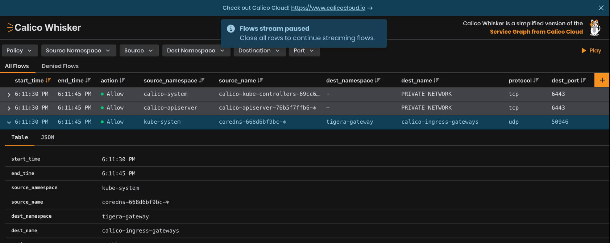
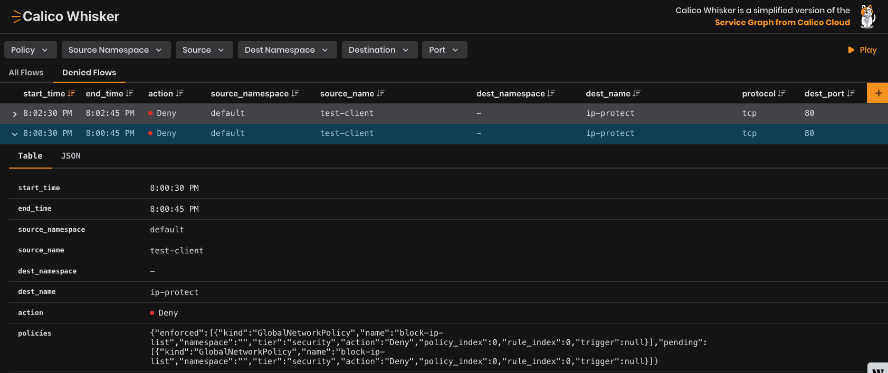

# Module 4 - Managing Egress Traffic: Network Sets and Egress Rules

  A **network set** resource is an arbitrary set of IP subnetworks/CIDRs that can be matched by standard label selectors in Kubernetes or Calico network policy. This is useful to reference a set of IP addresses using a selector from a namespaced network policy resource. It is typically used when you want to scale/reuse the same set of IP addresses in policy.

  A global network set resource is similar, but can be selected only by Calico global network policies.

- Create a network set for the facts service:

  First, get the IP addresses of the gateway services:
  ```kubectl describe svc -n tigera-gateway```

  Then create the network set, adding in the correct IPs:

  ```bash,copy
  GATEWAY_SERVICE_IP=$(kubectl get services -n tigera-gateway -l 'gateway.envoyproxy.io/owning-gateway-name=eg' -o jsonpath='{.items[0].spec.clusterIP}')
  ```

```bash,copy
kubectl apply -f -<<EOF
apiVersion: projectcalico.org/v3
kind: NetworkSet
metadata:
  namespace: tigera-gateway
  name: calico-ingress-gateways
  labels:
    calico-ingress-gateway: "true"
spec:
  nets:
    - $GATEWAY_SERVICE_IP/0
EOF
```

- Once again, generate traffic to the `/ns1` and `/ns2` paths.

  ```bash,copy
  kubectl exec test-client -- curl http://$GATEWAY_SERVICE_IP/ns1/subpath\?query=demo | jq
  ```

    ```bash,copy
  kubectl exec test-client -- curl http://$GATEWAY_SERVICE_IP/ns2/subpath\?query=demo | jq
  ```

- Return to Calico Whisker, where you should see some of the destination names replace with the name of the Network Set:

  

  > Top Tip: Using network sets to group IPs together can improve efficiency by centralizing management, as well as increasing performance with network policies. If network policies reference network sets instead of individual IPs, it reduces the number of IP tables rules that are written.


### Limit traffic to or from external networks, IPs in network policy

In the following example, a Calico NetworkPolicy allows egress traffic from pods with the label **color: red**, if it goes to an IP address in the 192.0.2.0/24 CIDR block.

```bash,copy
kubectl apply -f -<<EOF
apiVersion: projectcalico.org/v3
kind: NetworkPolicy
metadata:
  name: allow-egress-external
  namespace: default
spec:
  selector:{}
  types:
    - Egress
  egress:
    - action: Allow
      destination:
        nets:
          - $GATEWAY_SERVICE_IP
EOF
```

### Limit traffic to or from external networks, global network set

In this example, we use a Calico **GlobalNetworkSet** and reference it in a **GlobalNetworkPolicy**.

In the following example, a Calico **GlobalNetworkSet** deny-lists the CIDR ranges 192.0.2.55/32 and 203.0.113.0/24:

```bash,copy
kubectl apply -f -<<EOF
apiVersion: projectcalico.org/v3
kind: GlobalNetworkSet
metadata:
  name: ip-protect
  labels:
    ip-deny-list: 'true'
spec:
  nets:
    - 192.0.2.55/32
    - 203.0.113.0/24
EOF
```

Next, we create two Calico **GlobalNetworkPolicy** objects. The first is a high “order” policy that allows traffic as a default for things that don’t match our second policy, which is low “order” and uses the **GlobalNetworkSet** label as a selector to deny ingress traffic (IP-deny-list in the previous step). In the label selector, we also include the term **!has(projectcalico.org/namespace)**, which prevents this policy from matching pods or NetworkSets that also have this label. To more quickly enforce the denial of forwarded traffic to the host at the packet level, use the **doNotTrack** and **applyOnForward** options.

```yaml
kubectl apply -f -<<EOF
apiVersion: projectcalico.org/v3
kind: Tier
metadata:
  name: security
spec:
  order: 300
---
apiVersion: projectcalico.org/v3
kind: Tier
metadata:
  name: platform
spec:
  order: 400
---
apiVersion: projectcalico.org/v3
kind: GlobalNetworkPolicy
metadata:
  name: security.block-ip-list
spec:
  tier: security
  order: 50
  selector: all()
  types:
  - Egress
  egress:
  - action: Deny
    destination:
      selector: ip-deny-list == 'true'
  - action: Pass
EOF
```

Now try making requests to the IP addresses in the new network set:

```bash,copy
kubectl exec test-client -- curl -m5 http://192.0.2.55/
```

```bash,copy
kubectl exec test-client -- curl -m5 http://192.0.2.56/
```

```bash,copy
kubectl exec test-client -- curl -m5 http://203.0.113.3/
```

You should start to see denied flows in Calico Whisker, with the `security.block-ip-list` shown in the policy list as responsible:




## Network Sets and Threat Feeds in Calico Cloud and Calico Enterprise

Calico Cloud and Calico Enterprise allow you create dynamically updating threat feeds, as well as network sets with domain names (not just IP sets!).

### Threat Feeds


### Network Sets


## Packet Capture

  Pack capture allows you to capture live traffic inside a Kubernetes cluster, and export to visualization tools like Wireshark for troubleshooting and debugging applications.

  You can start a packet capture in the web console Service Graph, or using the CLI.

  Packet capture integration with Service Graph makes it very easy to capture traffic for a specific namespace, service, replica set, daemonset, statefulset, or pod. Just right-click on an endpoint to start or schedule a capture, and then download capture files to your favorite visualization tool like WireShark.

  With Calico Cloud packet capture you can:

  * Run packet capture whenever you want (available 24/7)
  * Preschedule packet captures to start and stop when needed
  * Customize packet captures by port and protocol
  * Share packet capture jobs
  
  

[:arrow_right: Module 5](module-5.md)  

[:arrow_left: Module 3](module-3.md) 

[:leftwards_arrow_with_hook: Back to Main](../readme.md)